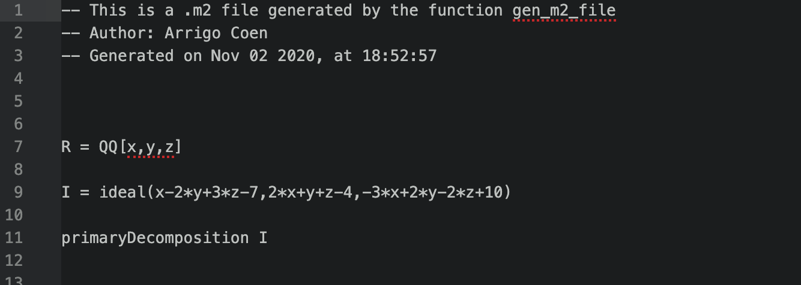
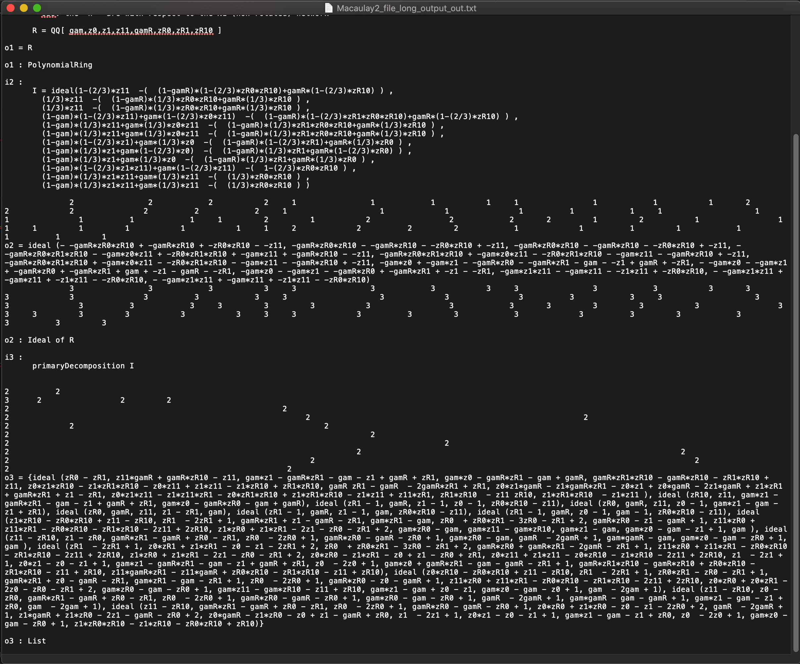
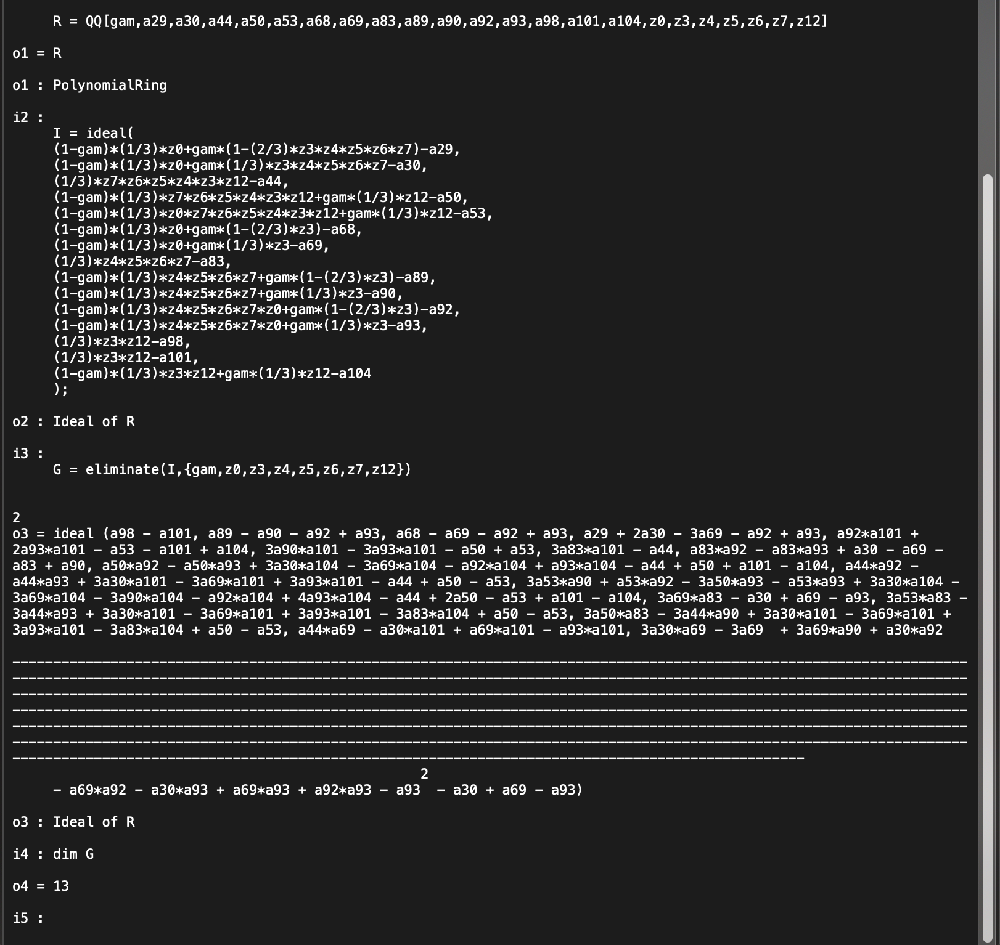

# How to use Macaulay2 with R

In this repository we present how to use Macaulay2 using R. In particular, we will show how to generate `.m2` files with R and then transform their output to use it on LaTeX.

To explain how this code works, let us find the solution to the system of equations:
```
x-2*y+3z=7
2*x+y+z=4
-3*x+2*y-2*z=-10
```

We are assuming that the Macaulay2 software is already installed in the computer. This software could be downloaded from [here](http://www2.macaulay2.com/Macaulay2/).

## Generating .m2 files

First, we need to generate the `.m2`files. To this end, let us define the next set of variables
```
initial_comments <- "This is a .m2 file generated by the function gen_m2_file\n Author: Arrigo Coen" # beginning comments
text_to_run <- "R = QQ[x,y,z] \nI = ideal(x-2*y+3*z-7,2*x+y+z-4,-3*x+2*y-2*z+10)\n primaryDecomposition I" # the equation to run
input_folder_m2_files <- "Macaulay2_input" # the folder were the .m2 files will be stored
output_folder_m2_files <- "Macaulay2_output" # the folder were the output files of the .m2 files will be save
input_file_name <- "Solving_equation_with_Macaulay2" # name of the .m2 file that we generate
output_file_name = "Solving_equation_with_Macaulay2_OUT" # name of output txt file
```
Using these variables the function `gen_m2_file` will generate a file named `Solving_equation_with_Macaulay2.m2`
```
gen_m2_file(text_to_run,M2_file_name,folder_M2_files, add_date=T)
```
this las command generates:



Moreover, if we have a vector with the equations that we want to solve, we could use the function `gen_eq_solver_text_for_m2_files`. This function use the next input and generates the variable `text_to_run`
```
vec_equations = c("x-2*y+3*z-7","2*x+y+z-4","-3*x+2*y-2*z+10")
vec_variables = c("x","y","z")
text_to_run = gen_eq_solver_text_for_m2_files(vec_variables, vec_equations)
```


## Running M2 files

Now, we want to run the `.m2` files in the terminal. To this end, we use the following command:
```
cd "/Users/arrigocoen/Dropbox/GitHub/2020 Arrigo Repos/How_to_use_Macaulay2_with_R"
cat Macaulay2_input/Solving_equation_with_Macaulay2.m2 | M2 &> Macaulay2_output/Solving_equation_with_Macaulay2_out.txt
```
This comment will run the file `Solving_equation_with_Macaulay2.m2` and print its output on the file `Solving_equation_with_Macaulay2_out.txt`.

To do this automatically using R, we could run the next commands
```
run_M2_Terminal_using_R(input_file_name,output_file_name,input_folder_m2_files,output_folder_m2_files)
```

I can not find a way to run Macaulay from R since I try to run something like (the first system() call does not give problems, the second one is the problematic)
```
terminal_command <- "cd '/Users/arrigocoen/Dropbox/GitHub/2020 Arrigo Repos/How_to_use_Macaulay2_with_R/Test_folder'"
system(terminal_command)
terminal_command <- "cat '/Users/arrigocoen/Dropbox/GitHub/2020 Arrigo Repos/How_to_use_Macaulay2_with_R/Test_folder/Macaulay2_file.m2' | M2 &> '/Users/arrigocoen/Dropbox/GitHub/2020 Arrigo Repos/How_to_use_Macaulay2_with_R/Test_folder/Macaulay2_file_out.txt'"
system(terminal_command)
```
and get the error message:
```
cat: stdout: Broken pipe
Warning message:
In system(terminal_command) : error in running command
```
wich is weird since I cuold type the commands directly in the Terminal and they run without problems.


## From M2 output to LaTeX

In some cases it is needed to transform the ouput of Macualay2 to use analyze it. For instance, the way that Macaulay2 handles exponents is to print them in a different line, as is presented in the next figure (from the file 'Macaulay2_output/Macaulay2_file_long_output_out.txt')



Also, Macualay2 uses strings of hyphens to separate lines; an example of this is presented in the next figure (from the file `K8_subN11211_out.txt`)



We transform this by:
- Selecting the output that is desired to correct. This is done by selecting the output-number and attach it to the variable `idx_output`. To exemplify, let us assume that we define `idx_output=3`
- With this number of output we extract the proper lines of the txt file. This is done by selecting from the previous line (in case that it contains the power the output line) until the line of the with the colon. In our example, we found the line with `o3 = ` and stop until finding `o3 : `. So, we obtain a vector with each line between this marks.
- In this vector we eliminate the lines that are only hyphens and we combine the lines of exponents with their respective equations.

The extraction of the vector is done by the function `raw_text_output_vector_text_M2` and its transformation by the function `add_powers_and_errase_extra_lines`. An example of this is done by:
```
txt_file <- 'Macaulay2_output/K8_allN11122_out.txt' # Example with a line of the type: "-----------" and exponents
data_txt = read.table(txt_file, fill = F, header = FALSE , sep = "\t")
idx_output <- 3
text_equation <- raw_text_output_vector_text_M2(idx_output,data_txt)
text_equation <- add_powers_and_errase_extra_lines(text_equation)
text_equation
```

Moreover, if the output if given compose of multiple `Ideal(...)` we could use the next code to transform it
```
vec_ideals <- extracting_all_ideal_equations(text_equation)
```
With this last line we obtain a vector such that each of its entries is the inside equations of the ideals.


An example of a long output could be obtain using
```shell
cd '/Users/arrigocoen/Dropbox/GitHub/2020 Arrigo Repos/How_to_use_Macaulay2_with_R'
cat 'Macaulay2_files/SolveK4_N_allow1112_for_N1vrN2.m2' | M2 &> 'Macaulay2_output/Macaulay2_file_long_output_out.txt'
```


# Other stuff


## Equations

R = QQ[z0,z1,z11,zR0,zR1,zR10,gam,gamR]
I = ideal(1-(2/3)*z11-(1-gamR)*(1-(2/3)*zR0*zR10)+gamR*(1-(2/3)*zR10),(1/3)*z11-(1-gamR)*(1/3)*zR0*zR10+gamR*(1/3)*zR10,(1/3)*z11-(1-gamR)*(1/3)*zR0*zR10+gamR*(1/3)*zR10,(1-gam)*(1-(2/3)*z11)+gam*(1-(2/3)*z0*z11)-(1-gamR)*(1-(2/3)*zR1*zR0*zR10)+gamR*(1-(2/3)*zR10),(1-gam)*(1/3)*z11+gam*(1/3)*z0*z11-(1-gamR)*(1/3)*zR1*zR0*zR10+gamR*(1/3)*zR10,(1-gam)*(1/3)*z11+gam*(1/3)*z0*z11-(1-gamR)*(1/3)*zR1*zR0*zR10+gamR*(1/3)*zR10,(1-gam)*(1-(2/3)*z1)+gam*(1/3)*z0-(1-gamR)*(1-(2/3)*zR1)+gamR*(1/3)*zR0,(1-gam)*(1/3)*z1+gam*(1-(2/3)*z0)-(1-gamR)*(1/3)*zR1+gamR*(1-(2/3)*zR0),(1-gam)*(1/3)*z1+gam*(1/3)*z0-(1-gamR)*(1/3)*zR1+gamR*(1/3)*zR0,(1-gam)*(1-(2/3)*z1*z11)+gam*(1-(2/3)*z11)-1-(2/3)*zR0*zR10,(1-gam)*(1/3)*z1*z11+gam*(1/3)*z11-(1/3)*zR0*zR10,(1-gam)*(1/3)*z1*z11+gam*(1/3)*z11-(1/3)*zR0*zR10)
primaryDecomposition I


R = QQ[x,y,z]
I = ideal(x-2*y+3*z-7,2*x+y+z-4,-3*x+2*y-2*z+10)
primaryDecomposition I


x-2*y+3z-7
2*x+y+z-4
-3*x+2*y-2*z+10

x-2*y+3z-7,2*x+y+z-4,-3*x+2*y-2*z+10)


Some commands
```
cd "/Users/arrigocoen/Dropbox/GitHub/2020 Arrigo Repos/How_to_use_Macaulay2_with_R"
cat My_Macaulay2_file.m2 | M2 &> My_Macaulay2_file_out.txt

cat My_Macaulay2_file2.m2 | M2 &> My_Macaulay2_file2_out.txt


cat My_Macaulay2_file3.m2 | M2 &> My_Macaulay2_file3_out.txt

```

A useful github with many Macaulay2 repositories is [this](https://github.com/Macaulay2)
